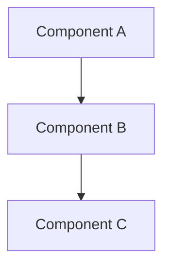

{Feature Name} - Plan

## Metadata
- **Based on Requirements:** {Link to requirements doc}

## Overview
{Brief description of the implementation approach}

## Architecture

### High-Level Design

{Describe the architectural approach}

### Design Patterns
- **Pattern 1:** {pattern-name} - {why it's used}
- **Pattern 2:** {pattern-name} - {why it's used}

### Technology Stack
- {Technology 1} - {version} - {purpose}
- {Technology 2} - {version} - {purpose}

## Implementation Phases

### Phase 1: {Phase Name}
**Goal:** {What this phase achieves}

**Tasks:**
- [ ] {Task 1}
- [ ] {Task 2}
- [ ] {Task 3}

**Deliverables:**
- {Deliverable 1}
- {Deliverable 2}

### Phase 2: {Phase Name}
**Goal:** {What this phase achieves}

**Tasks:**
- [ ] {Task 1}
- [ ] {Task 2}

**Deliverables:**
- {Deliverable 1}
- {Deliverable 2}

## Acceptance Criteria
- [ ] {Criterion 1}
- [ ] {Criterion 2}
- [ ] {Criterion 3}

## Success Metrics
- **{Metric 1}:** {Target value}
- **{Metric 2}:** {Target value}
- **{Metric 3}:** {Target value}

## Dependencies
- {Dependency 1}
- {Dependency 2}
