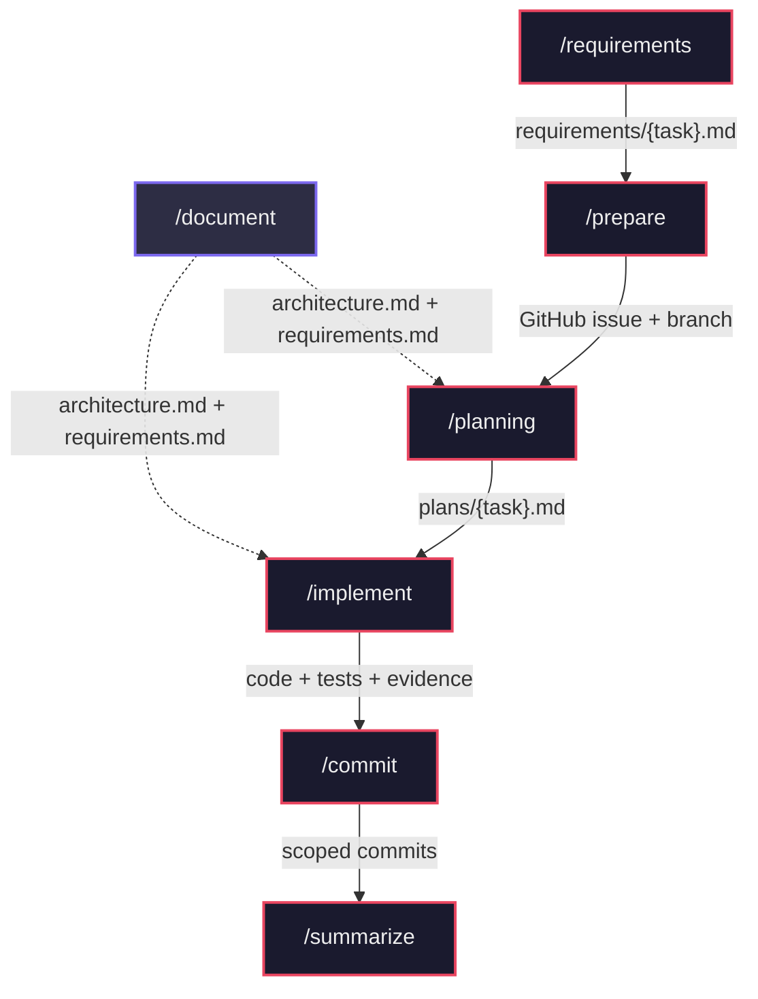
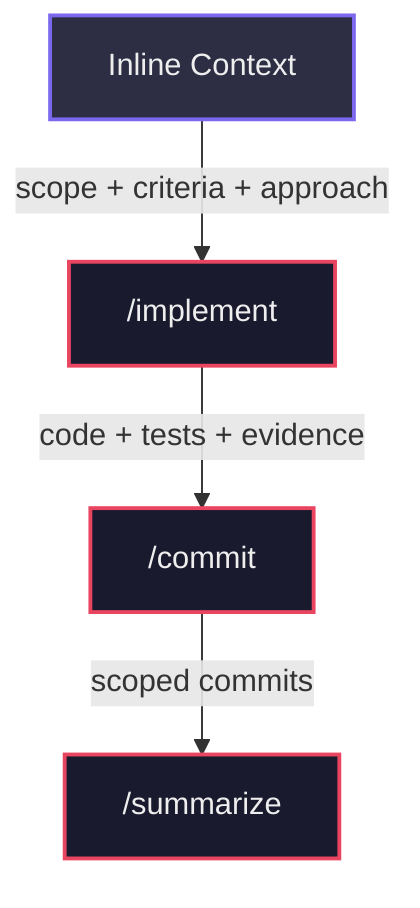

# Assisted Workflow

This project documents an AI-driven work methodology, based on the flow defined in `workflow/README.md`.

## Get Started

Install the workflow in your project with a single command:

### Claude Code

```bash
curl -fsSL https://raw.githubusercontent.com/This-Is-NPC/assisted_workflow/master/scripts/install.sh | bash -s -- --agent claude
```

### Codex

```bash
curl -fsSL https://raw.githubusercontent.com/This-Is-NPC/assisted_workflow/master/scripts/install.sh | bash -s -- --agent codex
```

### GitHub Copilot

```bash
curl -fsSL https://raw.githubusercontent.com/This-Is-NPC/assisted_workflow/master/scripts/install.sh | bash -s -- --agent github
```

### OpenCode

```bash
curl -fsSL https://raw.githubusercontent.com/This-Is-NPC/assisted_workflow/master/scripts/install.sh | bash -s -- --agent opencode
```

To update an existing installation (preserves your `CONTRIBUTING.md`):

### Claude Code (update)

```bash
curl -fsSL https://raw.githubusercontent.com/This-Is-NPC/assisted_workflow/master/scripts/install.sh | bash -s -- --agent claude --update
```

### Codex (update)

```bash
curl -fsSL https://raw.githubusercontent.com/This-Is-NPC/assisted_workflow/master/scripts/install.sh | bash -s -- --agent codex --update
```

### GitHub Copilot (update)

```bash
curl -fsSL https://raw.githubusercontent.com/This-Is-NPC/assisted_workflow/master/scripts/install.sh | bash -s -- --agent github --update
```

### OpenCode (update)

```bash
curl -fsSL https://raw.githubusercontent.com/This-Is-NPC/assisted_workflow/master/scripts/install.sh | bash -s -- --agent opencode --update
```

After installing, edit `CONTRIBUTING.md` with your project settings and start with `/requirements <your task>`.

## Objective

Record and compare the application of the methodology with different AI tools, maintaining a consistent and traceable process.

## Official Workflow

The step order is in `workflow/README.md`:

1. `/requirements`
2. `/prepare`
3. `/planning`
4. `/implement`
5. `/commit`
6. `/summarize`

The `/document` skill can be used at any point (standalone) to generate `architecture.md` and `requirements.md` as a project knowledge base. When these files exist, `/planning` and `/implement` automatically align new work to the documented patterns.

Each task follows a linear pipeline: a user request is validated and scoped into requirements, then tracked via a GitHub issue and branch. An execution plan is produced, code is implemented and validated against that plan, changes are committed following Conventional Commits, and finally a reviewer-ready summary compares the delivery against the original requirements.



### Step Breakdown

| Step | Purpose | Input | Output |
|------|---------|-------|--------|
| `/requirements` | Validate feasibility, clarify scope, and author requirements | User request | `workflow/requirements/{task}.md` |
| `/prepare` | Create GitHub issue and implementation branch | Requirements doc | GitHub issue + feature branch |
| `/planning` | Produce execution-ready plan with tests and risk analysis | Requirements doc | `workflow/plans/{task}.md` |
| `/implement` | Apply planned changes, run tests, and collect validation evidence | Plan + requirements | Code, tests, evidence |
| `/commit` | Create focused, scoped Conventional Commits | Working tree | Scoped commits |
| `/summarize` | Compare delivery against requirements and generate PR-ready summary | Requirements + plan + branch state | `workflow/summaries/{task}.md` |
| `/document` | Generate project knowledge base (standalone) | Codebase + optional user context | `architecture.md` + `requirements.md` |

### Shortcut: Inline Context

You don't always need the full pipeline. When requirements already exist externally (Azure DevOps, GitHub Projects, etc.), pass them directly to `/implement` using a `## Inline Context` header with **Scope**, **Acceptance Criteria**, and **Implementation Approach** sections. This lets you skip `/requirements`, `/prepare`, and `/planning` entirely. Similarly, `/summarize` can run standalone — from git history alone (no arguments), against an external reference URL, or from local files.



## Supported Agents

The same set of skills is available across 4 AI agents:

| Agent | Skills Path | Extras |
|-------|------------|--------|
| `.opencode` | `.opencode/skills/{name}/SKILL.md` | `.opencode/commands/{name}.md` (command wrappers) |
| `.github` | `.github/skills/{name}/SKILL.md` | — |
| `.claude` | `.claude/skills/{name}/SKILL.md` | `argument-hint` frontmatter + `$ARGUMENTS` |
| `.codex` | `.codex/skills/{name}/SKILL.md` | `.codex/skills/{name}/agents/openai.yaml` |

## Repository Structure

```
src/
  skills/                        # Canonical source for all skills
    commit/SKILL.md
    document/SKILL.md
    implement/SKILL.md
    planning/SKILL.md
    prepare/SKILL.md
    requirements/SKILL.md
    summarize/SKILL.md

scripts/
  sync-skills.sh                 # Distributes skills to all agent directories

workflow/
  requirements/                  # Requirements per task
  plans/                         # Implementation plans
  summaries/                     # Final summaries and evidence

.opencode/                       # OpenCode agent config
  skills/*/SKILL.md              #   (synced from src/skills/)
  commands/*.md                  #   Agent-specific command wrappers

.github/                         # GitHub Copilot agent config
  skills/*/SKILL.md              #   (synced from src/skills/)

.claude/                         # Claude Code agent config
  skills/*/SKILL.md              #   (synced from src/skills/)

.codex/                          # Codex agent config
  skills/*/SKILL.md              #   (synced from src/skills/)
  skills/*/agents/openai.yaml    #   Agent-specific configs
```

The `.gitignore` is configured to ignore generated content in `workflow/` subdirectories, preserving the structure with `.gitkeep` files.

## Model Tiers

Each skill declares a `model-tier` in its YAML frontmatter, indicating the recommended model capability level for orchestration tools to select appropriate models per task.

| Skill | `model-tier` | Rationale |
|-------|-------------|-----------|
| `/commit` | `small` | Pattern matching + mechanical formatting |
| `/prepare` | `small` | Template filling, well-constrained output |
| `/requirements` | `medium` | Feasibility check requires code comprehension, but output is structured |
| `/summarize` | `medium` | Synthesis of git history/diffs, template-driven |
| `/planning` | `large` | Architecture decisions, decomposition, risk analysis |
| `/implement` | `large` | Code generation, tests, self-review loop — capability translates to quality |
| `/document` | `large` | Deep codebase analysis, pattern identification, requirements extraction |

### Tier Definitions

| Tier | Use case | Example models |
|------|----------|---------------|
| `small` | Mechanical, constrained tasks with clear rules | Haiku, GPT-4o mini, small local models |
| `medium` | Structured reasoning with moderate judgment | Sonnet, GPT-4o |
| `large` | High judgment, open-ended reasoning, code generation | Opus, o3, GPT-4.5 |

### How Orchestration Tools Use Tiers

Read the `model-tier` field from each skill's frontmatter to route tasks to cost-appropriate models. Tiers are recommendations — developers can override them based on their quality/cost tradeoff preferences.

## Configuring CONTRIBUTING.md

`CONTRIBUTING.md` is the central configuration hub read by all skills as their first step. It contains project standards, template paths, and external tool configuration.

To adopt this workflow in a new project:

1. Copy `.docs/templates/contributing_template.md` to `CONTRIBUTING.md` in your project root.
2. Fill in the values for your project.

### Configurable Parameters

| Section | Parameter | Description | Example Values |
|---------|-----------|-------------|----------------|
| Commit Standards | types | Allowed commit types | `feat`, `fix`, `docs`, `refactor`, `chore`, `test`, `build`, `ci`, `perf` |
| Commit Standards | format | Commit message format | `type(scope): summary` |
| Commit Standards | language | Commit message language | English |
| Branch Naming | feature pattern | Branch name for features | `feature/{short-name}` |
| Branch Naming | fix pattern | Branch name for fixes | `fix/{short-name}` |
| Workflow Templates | Requirements path | Template for `/requirements` | `.docs/templates/user_story_template.md` |
| Workflow Templates | Plan path | Template for `/planning` | `.docs/templates/plan_template.md` |
| Workflow Templates | Summary path | Template for `/summarize` | `.docs/templates/summary_template.md` |
| Project Management | Tool | PM tool in use | GitHub Projects, Azure DevOps, Jira, Linear, None |
| Project Management | Access method | How the agent accesses the tool | CLI (`gh`, `az`, `jira-cli`), MCP server, API, Manual |
| Project Management | Project URL | Board/project identifier | URL or project ID |
| Project Management | Read tasks | Command/tool to list tasks | `gh project item-list 1 --owner org` |
| Project Management | Create issues | Command/tool to create issues | `gh issue create` or MCP tool name |
| Project Management | Update status | Command/tool to update task status | `gh project item-edit` or MCP tool name |
| Code Standards | conventions | Language-specific rules, linting, test framework | Project-specific |

## Skills Management

All skills are maintained in a single canonical location (`src/skills/`) and distributed to each agent directory via a sync script. This ensures every agent always has the same skill content.

### Editing a Skill

1. Edit the canonical file in `src/skills/{name}/SKILL.md`
2. Run the sync script:

```bash
bash scripts/sync-skills.sh
```

3. The script copies each skill to all 4 agent directories and prints a summary

### What the Sync Script Does

- Copies `SKILL.md` from `src/skills/{name}/` to `.opencode/skills/{name}/`, `.github/skills/{name}/`, `.claude/skills/{name}/`, and `.codex/skills/{name}/`
- Prints each copy operation and a final count (7 skills x 4 agents = 28 files)

### What the Sync Script Does NOT Touch

- `.opencode/commands/*.md` — OpenCode-specific command wrappers
- `.codex/skills/*/agents/openai.yaml` — Codex-specific agent configs
- Any other agent-specific configuration files
