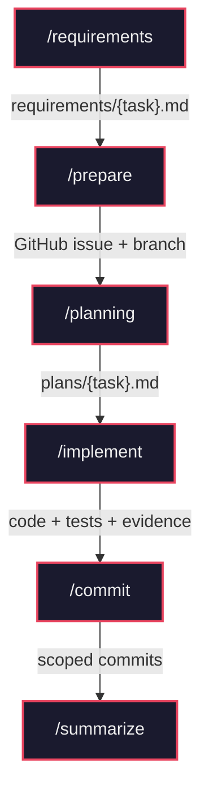
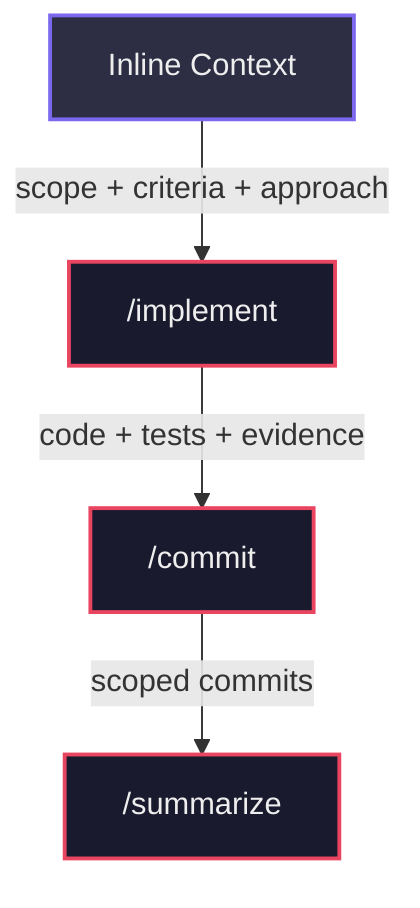

# Assisted Workflow

This project documents an AI-driven work methodology, based on the flow defined in `workflow/README.md`.

## Objective

Record and compare the application of the methodology with different AI tools, maintaining a consistent and traceable process.

## Official Workflow

The step order is in `workflow/README.md`:

1. `/requirements`
2. `/prepare`
3. `/planning`
4. `/implement`
5. `/commit`
6. `/summarize`

Each task follows a linear pipeline: a user request is validated and scoped into requirements, then tracked via a GitHub issue and branch. An execution plan is produced, code is implemented and validated against that plan, changes are committed following Conventional Commits, and finally a reviewer-ready summary compares the delivery against the original requirements.



### Step Breakdown

| Step | Purpose | Input | Output |
|------|---------|-------|--------|
| `/requirements` | Validate feasibility, clarify scope, and author requirements | User request | `workflow/requirements/{task}.md` |
| `/prepare` | Create GitHub issue and implementation branch | Requirements doc | GitHub issue + feature branch |
| `/planning` | Produce execution-ready plan with tests and risk analysis | Requirements doc | `workflow/plans/{task}.md` |
| `/implement` | Apply planned changes, run tests, and collect validation evidence | Plan + requirements | Code, tests, evidence |
| `/commit` | Create focused, scoped Conventional Commits | Working tree | Scoped commits |
| `/summarize` | Compare delivery against requirements and generate PR-ready summary | Requirements + plan + branch state | `workflow/summaries/{task}.md` |

### Shortcut: Inline Context

You don't always need the full pipeline. When requirements already exist externally (Azure DevOps, GitHub Projects, etc.), pass them directly to `/implement` using a `## Inline Context` header with **Scope**, **Acceptance Criteria**, and **Implementation Approach** sections. This lets you skip `/requirements`, `/prepare`, and `/planning` entirely. Similarly, `/summarize` can run standalone — from git history alone (no arguments), against an external reference URL, or from local files.



## Supported Agents

The same set of skills is available across 4 AI agents:

| Agent | Skills Path | Extras |
|-------|------------|--------|
| `.opencode` | `.opencode/skills/{name}/SKILL.md` | `.opencode/commands/{name}.md` (command wrappers) |
| `.github` | `.github/skills/{name}/SKILL.md` | — |
| `.claude` | `.claude/skills/{name}/SKILL.md` | `argument-hint` frontmatter + `$ARGUMENTS` |
| `.codex` | `.codex/skills/{name}/SKILL.md` | `.codex/skills/{name}/agents/openai.yaml` |

## Repository Structure

```
src/
  skills/                        # Canonical source for all skills
    requirements/SKILL.md
    prepare/SKILL.md
    planning/SKILL.md
    implement/SKILL.md
    commit/SKILL.md
    summarize/SKILL.md

scripts/
  sync-skills.sh                 # Distributes skills to all agent directories

workflow/
  requirements/                  # Requirements per task
  plans/                         # Implementation plans
  summaries/                     # Final summaries and evidence

.opencode/                       # OpenCode agent config
  skills/*/SKILL.md              #   (synced from src/skills/)
  commands/*.md                  #   Agent-specific command wrappers

.github/                         # GitHub Copilot agent config
  skills/*/SKILL.md              #   (synced from src/skills/)

.claude/                         # Claude Code agent config
  skills/*/SKILL.md              #   (synced from src/skills/)

.codex/                          # Codex agent config
  skills/*/SKILL.md              #   (synced from src/skills/)
  skills/*/agents/openai.yaml    #   Agent-specific configs
```

The `.gitignore` is configured to ignore generated content in `workflow/` subdirectories, preserving the structure with `.gitkeep` files.

## Skills Management

All skills are maintained in a single canonical location (`src/skills/`) and distributed to each agent directory via a sync script. This ensures every agent always has the same skill content.

### Editing a Skill

1. Edit the canonical file in `src/skills/{name}/SKILL.md`
2. Run the sync script:

```bash
bash scripts/sync-skills.sh
```

3. The script copies each skill to all 4 agent directories and prints a summary

### What the Sync Script Does

- Copies `SKILL.md` from `src/skills/{name}/` to `.opencode/skills/{name}/`, `.github/skills/{name}/`, `.claude/skills/{name}/`, and `.codex/skills/{name}/`
- Prints each copy operation and a final count (6 skills x 4 agents = 24 files)

### What the Sync Script Does NOT Touch

- `.opencode/commands/*.md` — OpenCode-specific command wrappers
- `.codex/skills/*/agents/openai.yaml` — Codex-specific agent configs
- Any other agent-specific configuration files
